# 🚀 Smart Terminal Handler (`sth`)

**A zero-config, cross-platform CLI and Node.js toolkit designed to supercharge your daily terminal workflows.**

[](https://npmjs.org/package/smart-terminal-handler)
[](https://opensource.org/licenses/ISC)
[](#)

[Features](#sparkles-features) • [Installation](#package-installation) • [CLI Usage](#keyboard-cli-usage) • [API](#computer-programmatic-api)



---

## 💡 Why `smart-terminal-handler`?

Developers constantly struggle with tedious, platform-dependent shell commands. `smart-terminal-handler` maps human-friendly commands to OS-specific terminal routines automatically under the hood for Windows, macOS, and Linux. No more memorizing `lsof -i`, `netstat -ano`, or `ipconfig /flushdns`!

## ✨ Features

- 🔌 **Smart Port Killer:** Identify and terminate zombie processes occupying development ports (e.g., `3000`). Maps automatically to platform-native commands (`lsof`/`kill` on macOS/Linux, `netstat`/`taskkill` on Windows).
- 🧭 **Interactive CLI Wizard:** Run `sth` without arguments to access an interactive, prompt-based menu for a fully guided experience.
- 📡 **IP Address Lookup:** Instantly view local IPv4 network interface addresses and resolve your public IP in a clean terminal layout.
- 🔄 **DNS Cache Flusher:** Flush DNS caching configurations reliably across Windows, macOS, and Linux systems.
- 💣 **Dependency Nuker:** Wipe out `node_modules` and lockfiles recursively using high-performance native commands, followed by an automated clean dependency reinstall (`npm`, `yarn`, or `pnpm`).
- 📊 **System Resource Dashboard:** Get a quick overview of CPU, memory, OS version, Node.js version, and system uptime formatted in a beautiful terminal table.

---

## 📦 Installation

You can run the utility instantly using `npx` without installing it permanently:

```bash
npx smart-terminal-handler <command>
```

Or install it globally to register the `sth` command alias:

```bash
npm install -g smart-terminal-handler
```

---

## ⌨️ CLI Usage

If you run the CLI without arguments, `sth` will launch an **interactive guided wizard**:

```bash
sth
```

### Supported Commands

#### 1. Terminate Port (`kill`)
Terminate processes listening on a target TCP port.
```bash
# Terminate processes on port 3000
sth kill 3000

# Open an interactive selector showing all active listening ports
sth kill
```

#### 2. Clean Dependencies (`nuke`)
Recursively delete `node_modules` and lockfiles in the current directory and run a clean reinstall.
```bash
# Clean directory and reinstall (prompts for confirmation)
sth nuke

# Skip confirmation prompt
sth nuke -y
# or
sth nuke --yes

# Clean without re-running dependency install
sth nuke --no-reinstall

# Clean but preserve lockfiles
sth nuke --no-lock
```

#### 3. View IP Configuration (`ip`)
Display your local network configuration and resolve your current public IP.
```bash
sth ip
```

#### 4. Flush System DNS (`dns`)
Flush the host machine's DNS caching layer.
```bash
sth dns
```

#### 5. System Resource Dashboard (`sys`)
View real-time statistics regarding your CPU architecture, memory utilization, Node version, and system uptime.
```bash
sth sys
```

---

## 💻 Programmatic API

You can import `smart-terminal-handler` as a dependency in your own projects to build automation scripts, custom dev tasks, or pipelines.

```bash
npm install smart-terminal-handler
```

### Usage Examples

```javascript
const { 
  killPort, 
  getActivePorts, 
  getLocalIPs, 
  getPublicIP, 
  flushDNS, 
  getSysInfo 
} = require('smart-terminal-handler');

// 1. Terminate a port programmatically
killPort(3000)
  .then((killedProcesses) => {
    killedProcesses.forEach(proc => {
      console.log(`Killed PID ${proc.pid} (${proc.command})`);
    });
  })
  .catch((err) => console.error('Failed to kill port:', err.message));

// 2. Fetch IP addresses
const localIPs = getLocalIPs();
localIPs.forEach(iface => {
  console.log(`Interface ${iface.interface}: ${iface.address}`);
});

getPublicIP().then(ip => console.log(`Public IP: ${ip}`));

// 3. Flush system DNS
flushDNS().then(result => {
  console.log(`Flushed DNS successfully using command: ${result.cmd}`);
});

// 4. Get System Info
const sysInfo = getSysInfo();
console.log(`Platform: ${sysInfo.platform}, Arch: ${sysInfo.arch}`);
```

---

## 📜 License

This project is licensed under the **ISC License**. Feel free to use and distribute it!
